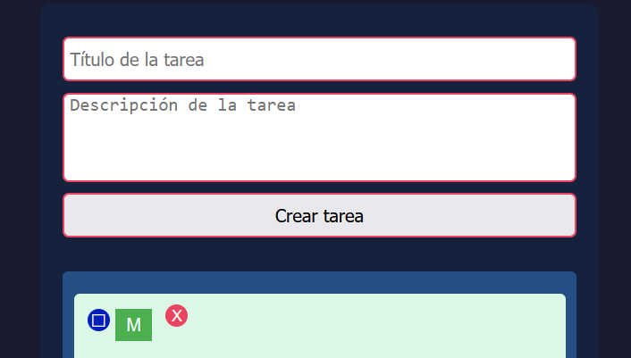

# 🧾 <h1 align="center">TO-DO LIST</h1> 🚀

Proyecto para una lista de tareas, también conocido como "To-Do List", construido con PHP y CSS. 

## 📋 Características

- Crear nuevas tareas con título y descripción 📝
- Marcar tareas como completadas ✅
- Editar tareas existentes 📝
- Eliminar tareas creadas ❌
- sincronización con mysql #️⃣

## 🛠️ Instalación

1. Clona este repositorio en tu pc.
2. Configura tu servidor para apuntar a la carpeta donde clonaste este repositorio. Aconsejo usar el XAMPP y darle a Start en Apache y MySQL para ver todo el contenido
3. Acceda en el navegador a la ruta del archivo, por ejemplo, http://localhost/PHP/todo%20list/To-Do-List/index.php

## 🗃️ Estructura de archivos

- `index.php`: Archivo principal que muestra las tareas.
- `db_conn.php`: Conexión a la base de datos.
- `style.css`: Estilos CSS.

## 📖 Uso

Abre `index.php` en tu navegador y podrás ver la lista de tareas. Desde allí, puedes añadir nuevas tareas, marcar tareas como completadas, editar tareas existentes y eliminar tareas. Veras los símbolos facilmente identificables para realizar cada acción

## 🙌 Contribuciones

Las contribuciones son siempre bienvenidas. Si tienes alguna idea o sugerencia para mejorar este proyecto, no dudes en abrir un issue o hacer un pull request.

## 👩‍💻 🎉 Autores

[DIANA 💜](https://github.com/dialomt)
